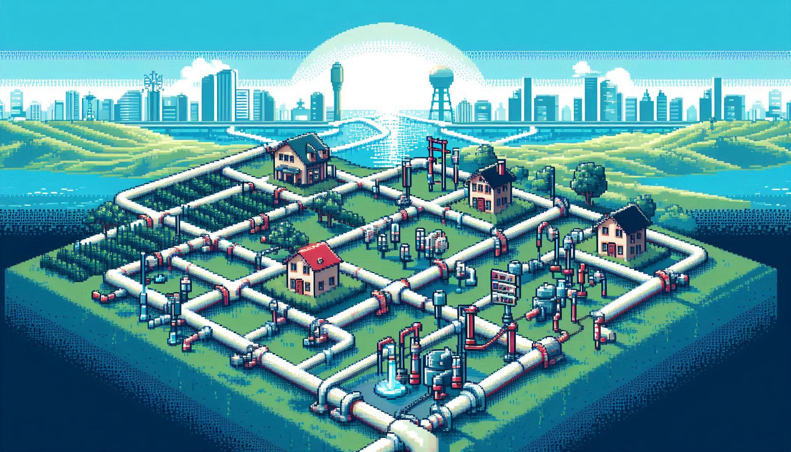

<div align="center">

<h3>Trabajo Final de Estructuras de Datos - FAI - UNCOMA</h3>
<h1>RED DE DISTRIBUCIÓN DE AGUA 2025</h1>



</div>

### Integrantes

-   Alzuguren Santiago \[FAI-4691\]
-   Borghese Nicolas \[FAI-997\]
-   Piacentini Gonzalo \[FAI-2514\]

### Descripción

Este proyecto se desarrolla en el contexto de la materia Estructura de Datos, y tiene como objetivo implementar un sistema en Java que modele una red de distribución de agua entre ciudades turísticas. El sistema pone énfasis en el uso de estructuras de datos eficientes y adaptadas al problema. Se implementa un grafo dirigido etiquetado, donde los vértices representan ciudades y los arcos las tuberías, siendo la etiqueta el caudal máximo. Las ciudades se almacenan en una tabla de búsqueda basada en un árbol AVL, ordenadas alfabéticamente por nombre. Además, se utiliza un HashMap con claves personalizadas (pares de nomenclaturas de ciudades) para mapear tuberías y su información detallada. Estas estructuras permiten realizar consultas complejas, como encontrar caminos óptimos de distribución, calcular volúmenes transportados y registrar el estado del sistema de forma eficiente.

### Instrucciones de ejecución

Correr el archivo que se encuentra en la siguiente dirección para ejecutar el programa:

```
src/main/java/main/TransporteAgua
```